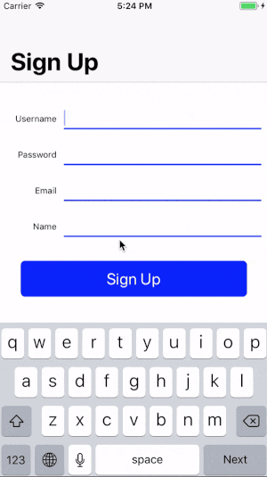

# Forms

This library provides basic functionality to add forms to your projects. It provides fields input and form logic alongside with validators. You will not find here UI components cause every app wants there own UI and it is really trivial task to add `UITextField` or `UITextView`.

I wrote this peace of code maybe 3 years ago and use in my projects. From project to project it requires really few if any changes to make to fit project needs.

It will take from about 2 hours and will get good validation and submission logic for forms. Just implement your designer's mockups.

#### Getting Started:

Add project via CocoaPods:

```
pod 'Forms'
```

Best way to understand how to implement your form using this library is look into Example project. There you will find how I do it in my projects.



Below all code snippets are taken from Example project.

Create your custom view for input field and implement `FormFieldView` protocol.

```
final class FieldView: UIView, FormFieldView {

    let textField = UITextField()
    let underline = UIView()
    let warningLabel = UILabel()
    let nameLabel = UILabel()

    var textInput: (UIResponder & InputTraits) {
        return textField
    }

    ......
}
```

In your ViewController create `Form` with one of the validation modes (online | offline). Configure `FormField` for every input and add it to your form. Attach your views to fields objects.

```
let form = Form(validationMode: .online)

let username = FormField(
    name: "Username",
    key: "login",
    behavior: .username,
    validator: UsernameValidator()
)
let password = FormField(
    name: "Password",
    key: "password",
    behavior: .password,
    validator: PasswordValidator()
)
form.formFields = [username, password]

let fieldViews = form.formFields.map { FieldView(field: $0)
fieldViews.last?.textField.returnKeyType = .join
fieldViews.forEach { self.formContainer.addSubview($0) }
```

Implement `FormDelegate` in your ViewController

```
extension ViewController: FormDelegate {

    func didSubmitForm() {
        //Your submission logic. Request to API
    }

    func formSumitionBecameAvailable(_ form: Form) {
        submitButton.isEnabled = true
    }

    func formSubmitionBecameUnavaliable(_ form: Form) {
        submitButton.isEnabled = true
    }

    func form(_ form: Form, didValidateWith result: ValidationResult) {}

}
```

Thats all.
Core of validation logic implement in `FormField.validate(mode:completion:)` method. You can find there usefull comments that maybe helps you understand why some of your cases don't works.
